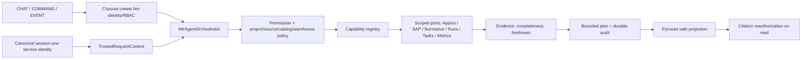

# Поведение проектного агента «МТР-аналитик»

## Назначение

«МТР-агент» отвечает на вопросы о демонстрационных спецификациях Appius, складских данных SAP, ответственности, аналогах, запусках сценариев и отчётах. Версия prompt `3.0.0` задаёт единый оркестратор `CHAT / COMMAND / EVENT`; rollback prompt `1.0.0` сохраняется неактивным. Fine-tuning не используется.

Агент не является источником оперативных фактов. `MtrAgentOrchestrator.handle(input, TrustedRequestContext)` выбирает capability, применяет canonical RBAC до retrieval и сохраняет bounded plan/audit. Legacy `AgentService` остаётся только chat-capability и rollback-путём; typed/natural commands используют один registry и production-shaped persistence ports.

## Инварианты

1. Identity, permissions, active project, role assignments, source/catalog scopes, warehouse claims и `authorizationVersion` берутся только из доверенной серверной сессии или service identity.
2. HTTP-схемы не принимают `userId`, permissions или role; selection является только hint и повторно проверяется.
3. `user_id` в сообщении пользователя удаляется до маршрутизации и не попадает в аргументы capabilities.
4. Перед фактическим ответом выполняется project/source/catalog/warehouse pre-filtered retrieval.
5. Capability принимает только типизированные результаты портов с completeness/freshness.
6. Citations создаются из фактических результатов и повторно авторизуются при каждом чтении; отозванный источник удаляется из публичной проекции.
7. Допустимость аналога определяется найденным правилом Normative и доменной функцией `buildAnalogueCoverage`, а не LLM.
8. Команда сохраняет received/completed/failed audit, durable case и bounded plan; критическое действие без обязательного аудита не коммитится.
9. L2 action выполняется только после явного confirm, повторной авторизации и проверки idempotency.
10. Partial/unknown/error не заменяются уверенным отрицательным или положительным выводом.
11. Отзыв доступен только владельцу assistant message и создаёт идемпотентный `LearningCandidate` со статусом `QUARANTINED`.
12. Feedback не меняет online behavior: approval требует `review.decide`, promotion/revoke — отдельного `prompt.activate`, а promotion невозможен без applicability, regression case и validation checksum.

## Поток запроса



## Серверный контракт

Рекомендуемый вызов отделяет недоверенное тело от доверенной identity:

```ts
const input = publicAgentRequestSchema.parse(await request.json());
const result = await orchestrator.handle(input, session.authorization);
```

Внешний Route Handler не копирует `userId`, role, scopes или grants из JSON в trusted request. Chat-capability получает legacy-compatible поля только из `TrustedRequestContext` внутри server composition.

Фабрики:

- `createAgentService(dependencies)` создаёт application service;
- `createMockLLMProvider()` создаёт детерминированный offline-провайдер;
- `IntegrationAwareLlmProvider` применяет управляемое состояние LLM из админки;
- `ConformingLlmProvider` является внешней границей provider call: редактирует секреты, ограничивает token/cost/rate budgets, передаёт cancel, прерывает timeout, проверяет structured output и поддерживает `MTR_AGENT_LLM_ENABLED=false`;
- `MockLLMProvider` реализует общий `LLMProvider` и не знает о базе или HTTP.

## Маршрутизация инструментов

| Вопрос | Обязательные вызовы |
|---|---|
| Список спецификаций | `appius.getState` → `appius.listSpecifications` |
| Актуальная версия | `appius.getState` → `appius.listSpecifications` → `appius.getLatestVersion` |
| Позиции | предыдущие вызовы → `appius.getPositions` для актуальной версии |
| Остаток по SAP-коду | `sap.getState` → `sap.getMaterialStock` |
| Название, синоним, RU/EN или legacy-код | `sap.getState` → `sap.searchMaterialStock` |
| Ответственность | актуальная позиция Appius → `norms.searchResponsibilityRules` |
| Аналог | актуальная позиция Appius → `norms.searchAnalogueRules` → при наличии правила SAP-поиск → доменный расчёт |
| Статус запуска | `scenario.getRun` |
| Результат позиции запуска | `scenario.getRun` → `scenario.getPositionResult` |
| Отчёт | `scenario.getRun` → `report.getSummary` |

`AgentService` передаёт `userId` каждому порту отдельным аргументом. Аргументы, извлечённые из текста, содержат только идентификатор предметной сущности или поисковую строку.

## Гибридный нормативный поиск и словари

`NormativeMockAdapter` читает применимые правила, versioned нормативные chunks и активный словарь `MTR_SEARCH_SYNONYMS` для trusted user. Он отбрасывает chunks без доступа, чужие данные и неприменимые типы оборудования, затем ранжирует оставшееся детерминированно:

- `55%` — совпадение структурированных metadata и applicability;
- `30%` — semantic-like сигнал по нормализованным понятиям, stems и словарю;
- `15%` — лексическое пересечение.

Внешний embedding service не используется. Для лучшего bilingual chunk правило получает `retrievalEvidence`: `chunkId`, `language`, итоговый `score`, `metadataScore`, `semanticScore`, `lexicalScore` и `matchedAttributes`. Citation при этом остаётся точной ссылкой на `documentId`, version и `clauseId`, а не на неподтверждённый текст.

Изменение активного словаря через админку действует со следующего запроса. Одни и те же понятия расширяют intent routing, разрешение позиции, SAP query/ranking и нормативные токены. Неактивные записи игнорируются; ошибка чтения словаря безопасно сводит расширение к пустому набору и фиксируется в audit.

## Источники и citations

Каждая citation содержит:

```json
{
  "sourceSystem": "APPIUS|SAP|NORMATIVE|SCENARIO|REPORT",
  "entityId": "точный идентификатор",
  "versionOrSnapshot": "версия или snapshot",
  "clauseId": "точный пункт правила либо null"
}
```

Правила ответственности и аналогов всегда получают `documentId`, версию и `clauseId`. Для Appius указывается версия спецификации; для SAP — дата снимка; для запуска — версия сохранённой записи и время обновления.

При пустом SAP-поиске citation указывает на сам запрос и snapshot результата. Это подтверждает отрицательный результат, не создавая несуществующую карточку материала.

## Внутренний ответ и пользовательская проекция

Сервис возвращает `GroundedAgentOutput`:

```json
{
  "answer": "краткий ответ на русском",
  "facts": [],
  "recommendations": [],
  "citations": [],
  "confidence": 0,
  "requiresHumanReview": false,
  "toolCalls": []
}
```

`toolCalls` формируется сервером по фактически выполненным действиям. Mock LLM возвращает это поле пустым, поэтому он не может заявить о несуществующем вызове.

Это внутренний контракт application-слоя. Перед HTTP-ответом `toPublicAgentDecision` создаёт отдельную проекцию: пользователь получает только итоговый `content`, citations, `confidence` и `requiresHumanReview`. Facts, recommendations, tool names, arguments, raw JSON, prompt/model metadata и технические ошибки в user chat/API не сериализуются. Если итоговый текст сам содержит имя внутреннего инструмента, JSON или признаки internal reasoning, он заменяется безопасным сообщением с обязательной экспертной проверкой.

Пользователь с `agent.logs.read` видит фактические операции отдельно на `/admin/agent-logs`: correlation, system/tool, редактированные args/result, duration, attempts, prompt/model metadata, citations и безопасный error code. Там же рассчитываются persisted-метрики команд, планов, действий, insights и event failures без чтения личного текста, payload или raw tool output. Таким образом, наблюдаемость не расширяет публичную поверхность диалога.

Если был фактический intent, но подтверждённых citations нет, сервис принудительно выставляет `confidence = 0` и `requiresHumanReview = true`.

## Детерминированный mock-провайдер

`MockLLMProvider` работает без ключа и сети. Он:

- читает только trusted fact envelopes от `AgentService`;
- формирует стабильные русские шаблоны для спецификаций, остатков, ответственности, аналогов, запусков и отчётов;
- выводит максимум восемь складских строк в основном ответе;
- не изменяет данные и не запускает инструменты самостоятельно;
- не добавляет citations, которых нет в envelope;
- использует `ru-RU` для чисел и UTC для отображения snapshot.

`IntegrationAwareLlmProvider` перед каждым ответом читает persisted state `LLM`: `AVAILABLE` вызывает mock сразу, `SLOW` — после контролируемой задержки, а `UNAVAILABLE`, `RATE_LIMITED` и `MALFORMED_RESPONSE` останавливают provider call с точным `LLM_*` code. Внешний `ConformingLlmProvider` охватывает весь вызов, включая эту задержку: вход очищается до делегирования, зависший вызов получает `AbortSignal`, а ответ проходит закрытую Zod-схему и выходной budget.

Metadata границы фиксирует `provider / model / version`, запрет обучения и retention, `reasoningPersistence: NONE` и budgets. В audit сохраняются эти metadata и безопасный error code, но не prompt, raw response или chain-of-thought. Текущий offline provider имеет нулевую стоимость; внешний provider без отдельного разрешения не подключается. `AgentService` при любом безопасном отказе возвращает fallback с `confidence = 0` и `requiresHumanReview = true`; citations и tool calls, полученные до отказа LLM, сохраняются.

## Аналоги

Последовательность жёстко ограничена:

1. Найти только актуальную позицию Appius.
2. Запросить правила Normative.
3. Если правил нет, остановить поиск и сообщить, что основание отсутствует.
4. Если правило есть, получить кандидатов SAP.
5. Передать позицию, кандидатов и правила в `buildAnalogueCoverage`.
6. Сформировать основной план покрытия и до трёх контрфактических альтернатив из того же набора допустимых кандидатов и того же pre-primary reservation snapshot.
7. Цитировать только реально распределённые материалы либо snapshot отрицательного поиска.

Внутри одного плана несколько allocations являются совместно необходимыми компонентами, а не альтернативами. Только основной план учитывается в общем run-local reservation ledger; альтернативы не меняют ledger и не изменяют базовый seed. Старый persisted coverage без explicit plans читается как один основной план. Неполное покрытие и любой verdict, отличный от `SUITABLE`, отправляются на экспертную проверку.

## Отказы и fallback

| Состояние | Поведение |
|---|---|
| Appius `UNAVAILABLE` | Не запрашивать спецификации; предложить ручную загрузку |
| Appius `ACCESS_DENIED` | Не запрашивать позиции; показать безопасный запрет доступа |
| Appius `STALE_VERSION` | Не анализировать устаревшие позиции; запросить актуальный источник/ручную загрузку |
| SAP `UNAVAILABLE` | Не утверждать остаток; предложить CSV/Excel |
| SAP `RATE_LIMITED` | Не повторять автоматически в рамках ответа; предложить ручной импорт/повтор позднее |
| SAP `MALFORMED_RESPONSE` | Отклонить payload после валидации; не показывать частичные данные |
| SAP `STALE` | Разрешить чтение с датой snapshot, предупреждением и human review |
| RAG `SLOW` | Выполнить тот же детерминированный гибридный поиск после `delayMs` |
| RAG `UNAVAILABLE` | Вернуть `RAG_UNAVAILABLE`; не назначать ответственность и не подтверждать аналог |
| RAG `RATE_LIMITED` | Вернуть `RAG_RATE_LIMITED`; не повторять инструмент автоматически в рамках ответа |
| RAG `MALFORMED_RESPONSE` | Вернуть `RAG_MALFORMED_RESPONSE`; сценарный шаг сохраняет failure и рекомендует retry |
| Scenario/Report недоступен | Не угадывать статус или сводку |
| LLM `SLOW` | Вызвать offline mock после `delayMs` |
| LLM `UNAVAILABLE`, `RATE_LIMITED`, `MALFORMED_RESPONSE` | Вернуть соответствующий безопасный `LLM_*` fallback без придуманного вывода, сохранив подтверждённые citations |
| `MTR_AGENT_LLM_ENABLED=false`, timeout, cancel или budget violation | Не вызывать либо прервать provider; вернуть безопасный fallback с обязательной ручной проверкой |

Пользовательские ошибки не содержат stack trace, SQL, connection string, секрет или внутренний endpoint. Технический аудит хранит только код ошибки и безопасную сводку.

## Аудит

Для каждого tool call записываются две операции:

- `agent.tool.request` — имя инструмента, система и идентификатор сущности;
- `agent.tool.result` — исход `SUCCESS|FAILURE`, длительность, количество/статус и безопасный error code.

Текст сообщения, prompt, payload, content, секреты, токены, cookies и ключи редактируются. Отдельно фиксируются:

- `agent.request.received`;
- `agent.security.prompt_injection_blocked`;
- `agent.security.user_id_override_ignored`;
- `agent.response.completed`.

Repository-фильтры `/admin/agent-logs` применяются в параметризованном user-scoped SQL до pagination. Общие метрики request/success/failure, p50/p95, retry и review считаются по полному user-scoped набору независимо от страницы, а журнал показывает bounded page до 100 отфильтрованных операций и честные значения «найдено/показано»; старые correlations не теряются за лимитом последних событий.

## Feedback и курируемое обучение

Под каждым сохранённым ответом владелец может выбрать один из девяти закрытых типов отзыва: полезно, неверный факт/причина/прогноз, пропущенный фактор, неподходящая рекомендация, отсутствующий источник, неверно понятый вопрос или небезопасное действие. `POST /api/agent/messages/:id/feedback` не принимает identity, permission или project из body и возвращает только безопасную квитанцию карантина.

Запись `agent_learning_candidates` связывает отзыв с assistant message, проектом, владельцем, prompt/model/rule/evidence versions и audit. Повторный отзыв на тот же ответ не создаёт второй кандидат. Свободный комментарий проходит redaction и не становится prompt, rule или knowledge автоматически.

Каждый завершённый аналитический расчёт также создаёт личный durable case. В нём
сохраняются версии dataset/semantic/forecast, краткий вывод, рекомендация и отдельные
evidence facts. Повторный расчёт той же позиции сравнивается с предыдущим и показывает,
изменился ли вывод. При каждом чтении источники авторизуются заново; потерявший доступ
пользователь увидит число скрытых источников, но не их содержимое.

Lifecycle закрыт состояниями `QUARANTINED → APPROVED → PROMOTED → REVOKED` либо `REJECTED`. Approval требует applicability, отдельный regression case и SHA-256 checksum validation; promotion и rollback проходят отдельную авторизацию и атомарный audit. Личные чаты не становятся общей памятью, а promoted-кандидат сам по себе не изменяет веса модели или operational state.

## Prompt injection и privacy

Прямая попытка изменить системные правила, раскрыть system prompt или вызвать неразрешённый инструмент блокируется до LLM и бизнес-инструментов. Инструкции внутри загруженного документа считаются данными.

Если сообщение содержит `user_id=other-user-999`, это значение удаляется. Инструменты всё равно вызываются только с `demo-user-001`, полученным из server session. В ответе появляется краткая отметка, что текстовый `user_id` проигнорирован; чужой идентификатор не отражается обратно.

В prompt, few-shot, eval и runtime-ответах используются только синтетические демонстрационные сущности. Реальные контакты и персональные данные не допускаются.

## Eval-набор

Файл `evals/mtr-agent-cases.jsonl` содержит 34 золотых случая. Покрыты:

- точный код, синоним, RU/EN-название и legacy-код;
- недостаточное количество;
- одиночный и составной аналог;
- отсутствие нормативного основания;
- актуальная и устаревшая версия;
- запрет доступа;
- `UNAVAILABLE`, `STALE`, `RATE_LIMITED`, `MALFORMED_RESPONSE`;
- prompt injection из сообщения и документа;
- подмена `user_id`;
- status, position result и report;
- отказ Normative и LLM.

Каждая строка — отдельный валидный JSON-объект с обязательными/запрещёнными инструментами, требованиями к citations и безопасному ответу.

Отдельный integration-набор `tests/integration/normative-agent-runtime.test.ts` проверяет bilingual hybrid retrieval, влияние активного admin-словаря, точные `RAG_*`/`LLM_*` коды, audit и сохранение citations при отказе LLM. `tests/unit/agent-provider-conformance.test.ts` отдельно закрепляет redaction-before-provider, kill switch, rate/token/output limits, timeout/cancel и strict structured output.

Versioned `evals/mtr-agent-provider-cases.jsonl` добавляет 20 исполняемых provider-boundary кейсов: 4 validation, 4 held-out и 12 adversarial. Они не дублируют общие unit assertions, а проверяют data-driven oracle для redaction, изоляции rate window, kill switch, token/cost budgets, timeout/cancel, unsafe data policy и невалидных ответов. Запуск: `pnpm eval:agent:provider`.

Versioned `evals/mtr-agent-security-cases.jsonl` содержит ещё 32 исполняемых security-кейса. Набор проверяет разрешения всех команд до handler, project/resource/period/warehouse scope до retrieval, запрет подмены identity/grants во входе, повторную авторизацию сохранённых citations, отсутствие existence leak у cross-project case и повторную проверку `authorizationVersion`/permission перед L2-действием. Запуск: `pnpm eval:agent:security`.

Versioned `evals/mtr-agent-scale-cases.jsonl` содержит 20 distinct ANALYSIS-кейсов по 12 спецификациям санкционированной когорты `g1-vertical-v1`: components, assemblies, intentional negatives и analogue boundaries. Runner выполняет два батча по 10 запросов к единому runtime, проверяет соответствие ответа позиции, отсутствие cross-request context mixing, bounded public payload и нулевое обращение к legacy/LLM capability. Запуск: `pnpm eval:agent:scale`.

Versioned `evals/mtr-agent-multi-turn-cases.jsonl` завершает curriculum 27 трёхходовыми диалогами. Пятнадцать sensitivity-кейсов проверяют базовый анализ, эллиптический follow-up в том же thread/page context и детерминированное восстановление исходного расчёта. Двенадцать feedback-кейсов проверяют цепочку analysis → quarantined feedback → повторный analysis: поведение не меняется online, а prompt/model/rule/evidence provenance сохраняется. Запуск: `pnpm eval:agent:multi-turn`.

## Ограничения прототипа

- Intent routing и извлечение идентификаторов детерминированы и рассчитаны на демонстрационные формулировки.
- Mock-провайдер не ведёт свободный многошаговый диалог и не заменяет инженерную экспертизу.
- Текущий объём и latency подтверждаются только для fixture-набора прототипа.
- Достоверность промышленного Appius/SAP-контракта должна проверяться отдельными production-адаптерами.
