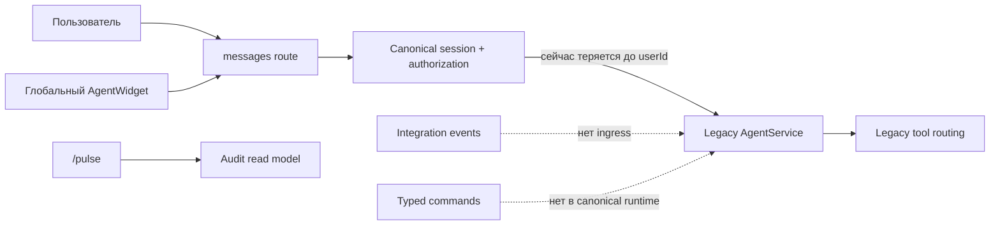

# Baseline МТР-агента-оркестратора

Дата фиксации: 13.08.2026.

## Исходная точка

| Область | Фактическое состояние |
|---|---|
| Git | `codex/feat-mtr-agent-orchestrator` от `1855e78f8b6206586fd417cffa27583e78c6a4f4` |
| Приложение | Next.js App Router в корне репозитория |
| RBAC | Канонические `TrustedRequestContext`, `AuthorizationService`, 48 permissions, 7 ролей |
| Миграции | `0000`–`0005`; `0004` и `0005` immutable для этой задачи |
| Chat | Legacy `AgentService.respond`, server route передаёт только `userId` |
| Commands | В канонической ветке отсутствуют |
| Widget | Глобальный, но использует legacy chat и не очищает context после role switch |
| Events | `/pulse` отображает audit; event ingress/subscriber/outbox агента отсутствуют |
| Cases/evidence/actions | Самостоятельного durable lifecycle нет |
| Review | Канонический decision store: `analysis_review_decisions` |
| Preview | Новый exact-SHA Preview недоступен без внешней аутентификации |

## Baseline quality gate

| Проверка | Результат |
|---|---:|
| ESLint | PASS |
| Typecheck и route type generation | PASS |
| Vitest | 79 файлов / 326 тестов PASS |
| Privacy scan | 314 файлов PASS |
| Agent eval | 34/34 PASS |
| Production build | PASS |
| PDF runtime assets | 2/2 PASS |

Generated `tsconfig.tsbuildinfo`, изменённый typecheck, не относится к продуктовой реализации и не должен попасть в коммиты.

## Карта runtime

Целевой seam: route adapter → единый `MtrAgentOrchestrator` → permission-filtered capability registry → durable execution/evidence/audit → public projection.

## Сохранённые возможности

- `/mtr-analysis` остаётся основным рабочим контуром; отдельный `/agent` не возвращается.
- «Даблчекер МТР» и `analysis_review_decisions` не дублируются.
- `/admin/scenarios`, `/pulse`, `/help`, overview, analytics, import и widget расширяются capability links, а не копируются.
- Legacy chat сохраняется под rollback flag до завершения миграции.
